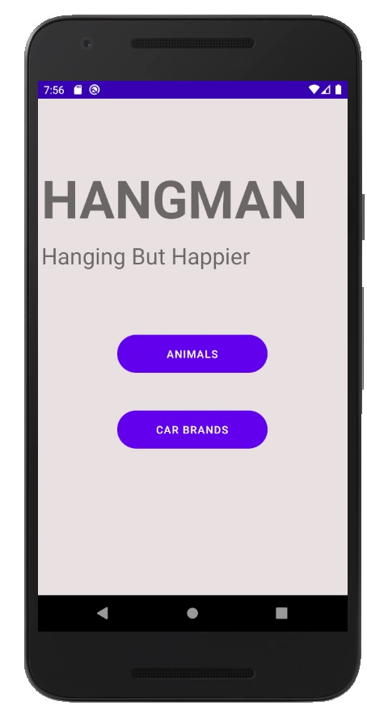
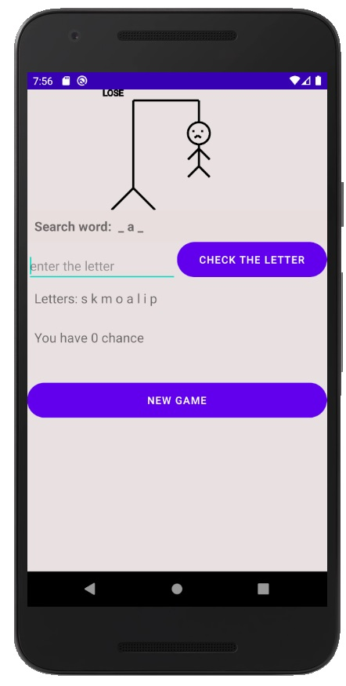
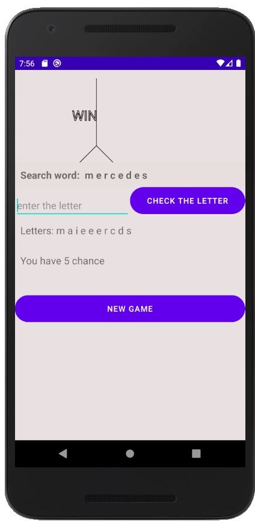

# Hangman

Simple hangman game to guessing issues.

# Table of Contens
* [General info](#general-info)
* [Technologies](#technologies)
* [Features](#features)

## General info

Select categories of issues and check your knowledge. Remember if you lose, you will hang.

## Technologies
Kotlin, OOP (object oriented programming)

In next project I use: Dagger and MVVM

## Features

A few of the things you can do with QuestBook:
- choose category of issues
- try to guess
- don't hang

 
